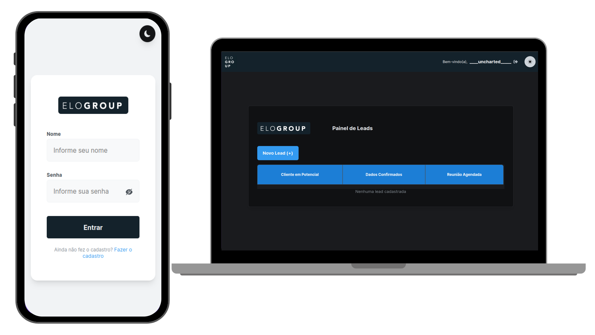

# Desafio - Plataforma de Cadastro de Leads

## Visão Geral

O desafio de desenvolvimento consiste em criar uma plataforma de cadastro de leads, proporcionando aos clientes a capacidade de efetuar login ou criar uma nova conta. A plataforma oferece uma interface de usuário moderna com recursos de notificação, validação de entrada, temas de aparência e autenticação de token.

## Funcionalidades Principais

1. **Login e Cadastro de Conta**
   - Os usuários podem efetuar login com suas contas existentes ou criar uma nova conta se não tiverem uma.
   - Senhas são armazenadas de forma segura usando hashing (apenas para fins de demonstração).

2. **Painel Principal**
   - O painel principal exibe uma tabela com as leads cadastradas.
   - Um botão "Adicionar Nova Lead" abre um modal moderno para inserção de novas leads.
  
3. **Cadastro de Nova Lead**
   - O modal "Novo Lead" permite aos usuários inserir informações sobre uma nova lead, incluindo nome, telefone e e-mail.
   - Campos de seleção permitem categorizar a lead em diferentes áreas, como "Todos", "RPA", "Analytics", "Produto Digital" e "BPM".
   - Todos os campos possuem validação de entrada usando a biblioteca Zod e React Hook Forms.

4. **Notificações**
   - A plataforma implementa um sistema de notificação usando a biblioteca React-Hot-Toast para fornecer feedback ao usuário.

5. **Tema de Aparência**
   - A plataforma suporta temas de aparência, permitindo aos usuários alternar entre o tema escuro e claro.

6. **Autenticação e Segurança**
   - A plataforma utiliza um sistema de token de autenticação para impedir que os usuários autenticados sejam redirecionados para a tela de login (apenas para fins de demonstração).
   - Senhas são armazenadas de forma segura com hashing e comparadas no processo de login (apenas para fins de demonstração).

7. **Armazenamento de Dados**
   - Os dados são armazenados localmente no LocalStorage do navegador (apenas para fins de demonstração).

8. **Drag and Drop**
   - A plataforma oferece a funcionalidade de arrastar e soltar para as etapas de leads, permitindo que os clientes movam leads entre as categorias.

## Tecnologias Utilizadas

- React.js com Vite para o desenvolvimento da interface do usuário.
- Módulos SCSS para estilos CSS.
- Bibliotecas de terceiros como Zod, React Hook Forms e React-Hot-Toast para validação, formulários e notificações.
- Uso de temas de aparência para melhorar a experiência do usuário.

## Observações

Este desafio de desenvolvimento é destinado apenas para fins de demonstração e educação. Em um ambiente de produção real, a autenticação, armazenamento de dados e segurança de senhas seriam implementados de maneira diferente e mais segura.
